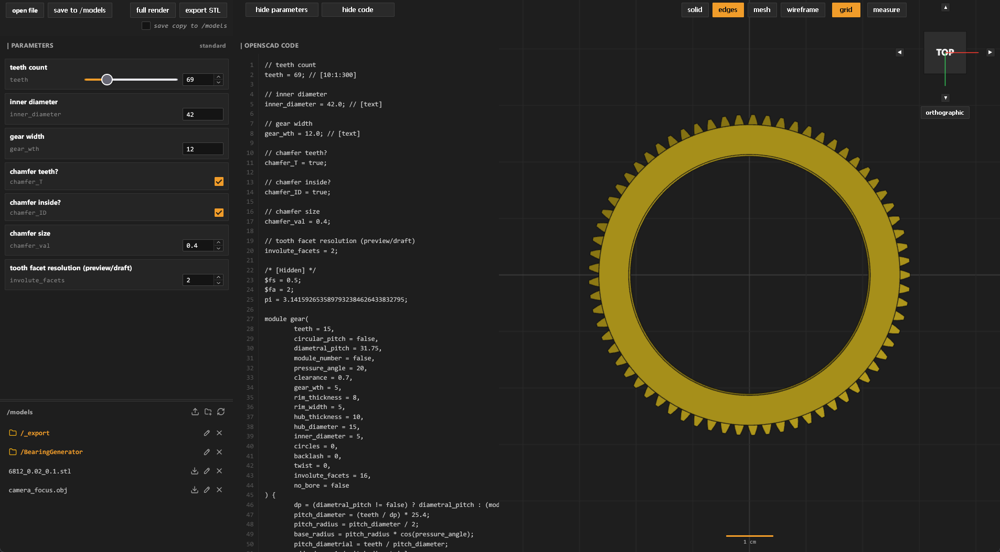
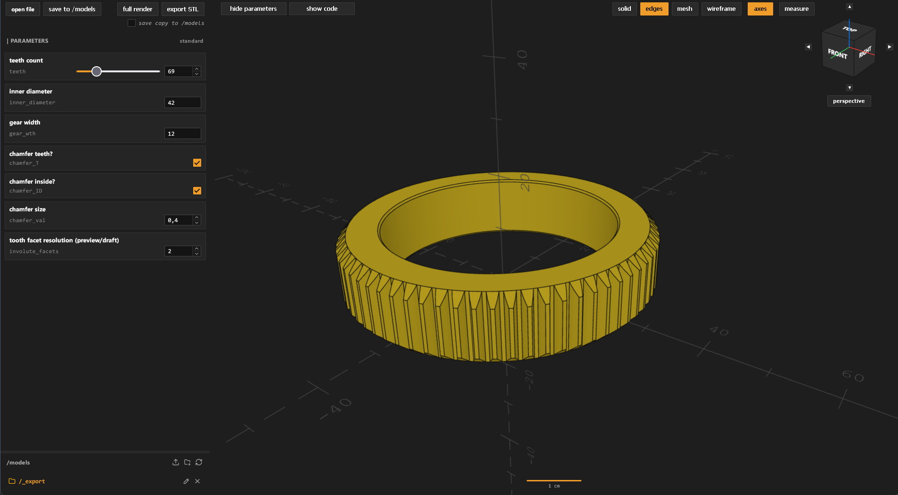

#  SCADarina

a self-hosted docker container for your personal OpenSCAD generator and model viewer

---




---

`SCADarina` is the attempt to have your own, self-hosted OpenSCAD online (or local offline) generator as the likes of Thingiverse, Printables, or MakerWorld.
It parses OpenSCAD controls (like you'd see on one of those online generators), but you can also open and alter code directly; I wouldn't setup a document in there though :)

- a viewport with different shading options, grid layouts (I tried to mimic the OpenSCAD axis as well), a switch between orthogonal and perspective view, and a basic viewcube as known from most CAD packages
- can make use of OpenSCAD libraries / dependencies (like e.g. [BOSL2](https://github.com/BelfrySCAD/BOSL2/))
- you can also open .stl, .obj, and .3mf files to e.g. roughly inspect or measure them
- that said: a measuring function, snapping to vertices, with delta readings
- a rudimentary file browser: you can create folders, upload and delete files, or save your current settings
- works on mobile browsers (but I probably have to spend some time improving on that, haha)
- has no online dependencies: you can use it offline

---

## install with docker compose

Clone the repository and run:

```bash
docker compose up -d --build
```

Access the WebUI at `http://<your-ip>:5343`.

---

## unRAID Installation

`SCADarina` is not yet part of the community apps plugin: I assembled [UNRAID_INSTALL.md](UNRAID_INSTALL.md) for a step-by-step instruction how to integrate the docker into unRAID with native WebUI, and template support.

---

## Disclaimer

This project relied on vibe-coding; please use another solution if you are not comfortable with this.
It's not an ideal solution. But it solves an issue for me, maybe it will solve one for you.

---

## Third-Party Licenses & Credits

This project relies on the following projects:

- [**OpenSCAD**](https://openscad.org/)
  - License: [GPLv2](https://github.com/openscad/openscad/blob/master/COPYING)
  - Used in the backend container for model compilation and rendering
- [**Three.js**](https://github.com/mrdoob/three.js)
  - License: [MIT License](https://github.com/mrdoob/three.js/blob/master/LICENSE)
  - Copyright © 2010-2024 Three.js Authors
- [**fflate**](https://github.com/101arrowz/fflate)
  - License: [MIT License](https://github.com/101arrowz/fflate/blob/master/LICENSE)
  - Copyright © 2020-2023 Arjun Barrett
- [**Lucide Icons**](https://lucide.dev/)
  - License: [ISC / MIT License](https://lucide.dev/license)
  - Copyright © 2026 Lucide Icons and Contributors, 2013-present Cole Bemis